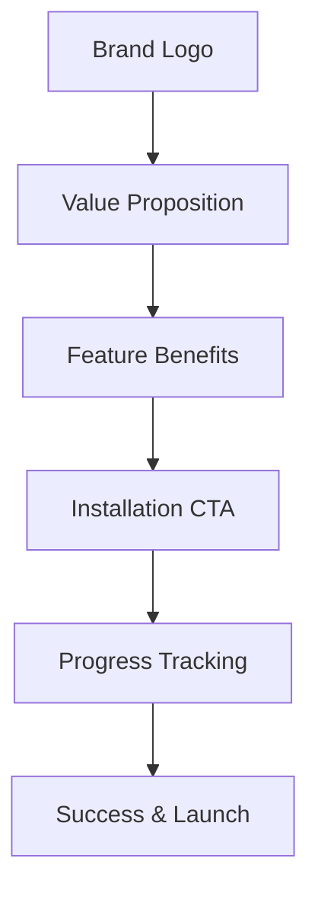

# 🎨 Visual Enhancements - Claude Proxy Smart Installer

## ✨ Brand Integration Complete!

The installer now features **professional branding** with the original Claude Code Proxy logo and a cohesive visual identity.

## 🖼️ Logo Integration

### **Main Logo Display**
- **Full SVG Logo**: The complete animated Claude Code Proxy banner is embedded
- **Responsive Design**: Scales beautifully from mobile to desktop
- **Interactive Effects**: Hover animations with glowing shadows
- **Perfect Integration**: SVG content loaded as raw data for smooth rendering

### **App Icon**
- **Simplified Icon**: Created a clean, professional app icon from the brand elements
- **Cross-Platform**: Configured for Windows (.ico), macOS (.icns), Linux (.png)
- **Consistent Branding**: Uses the same color palette and design language

## 🎨 Visual Design System

### **Color Palette**
```css
Primary Orange:   #E07A5F (brand color)
Secondary Orange: #D67B5F (gradients)
Success Green:    #4CAF50 (savings highlight)
Background Dark:  #2D2D2D (terminal theme)
Accent White:     #FFFFFF (text)
```

### **Typography**
- **Headers**: Large, glowing text with brand color
- **Body**: Clean, readable monospace font (terminal theme)
- **Emphasis**: Green highlights for savings/benefits
- **Buttons**: Bold, uppercase, professional styling

### **Layout Components**
- **Logo Header**: Prominent brand display at top
- **Feature Grid**: Professional 2x2 grid showcasing benefits
- **Progress Tracking**: Visual step-by-step installation flow
- **Glass Morphism**: Semi-transparent panels with backdrop blur

## 🚀 Enhanced Welcome Screen

### **Professional Messaging**
```
🚀 Welcome to the Smart Installer!
Get 15x cheaper Claude Code performance in minutes
```

### **Feature Highlights Grid**
| Icon | Feature | Benefit |
|------|---------|---------|
| 🔍 | **Smart Detection** | Automatically finds existing dependencies |
| 📥 | **Download-on-Demand** | Only downloads missing (~15MB vs 400MB) |
| ⚙️ | **Auto-Configuration** | Sets up CLI, API keys & shortcuts |
| ⚡ | **Ready in Minutes** | 5-10 minutes total installation time |

### **Call-to-Action**
- **Primary Button**: Large, prominent "🚀 Start Smart Installation"
- **Subtitle**: "One click • No manual steps • Professional experience"
- **Visual Hierarchy**: Clear progression from brand → benefits → action

## 🎭 Animation & Interactivity

### **Logo Animations**
- **Hover Effects**: Scale and shadow transformations
- **Original Animations**: Preserved all SVG animations (pixel fade-in, glow, shine)
- **Performance**: Smooth 60fps animations with CSS transforms

### **Interactive Elements**
- **Buttons**: Hover lift effect with gradient shifts
- **Feature Cards**: Subtle elevation on hover
- **Progress Bars**: Smooth width transitions with gradient fills
- **Form Elements**: Focus states with brand color highlights

## 📱 Responsive Design

### **Breakpoints**
- **Desktop**: Full grid layout, large logo (450px)
- **Tablet**: Responsive grid, medium logo (350px)
- **Mobile**: Single column, compact logo, touch-friendly buttons

### **Cross-Platform Consistency**
- **Windows**: Professional installer aesthetic
- **macOS**: Native app styling with Aqua influences
- **Linux**: Clean, functional design respecting system themes

## 🏆 Professional Polish

### **Visual Hierarchy**
1. **Brand Recognition**: Logo prominently displayed
2. **Value Proposition**: "15x cheaper" immediately visible
3. **Feature Benefits**: Grid showcases key advantages
4. **Call to Action**: Clear, prominent installation button
5. **Progress Feedback**: Real-time installation tracking

### **User Experience Flow**


## 🔧 Technical Implementation

### **SVG Integration**
```javascript
// Raw SVG import for optimal performance
import logoSvgContent from './logo.svg?raw'

// Dynamic injection into Vue template
<div class="logo-svg" v-html="logoSvg"></div>
```

### **CSS Architecture**
```css
/* Brand color variables */
:root {
  --brand-primary: #E07A5F;
  --brand-secondary: #D67B5F;
  --brand-success: #4CAF50;
}

/* Component-based styling */
.logo-svg { /* Logo container */ }
.welcome-screen { /* Welcome layout */ }
.features-grid { /* Benefits grid */ }
.installation-cta { /* Action buttons */ }
```

### **Icon Generation**
- **SVG Source**: Simplified version of main logo
- **Multi-Format**: Configured for .ico, .icns, .png generation
- **Build Integration**: Tauri automatically converts for each platform

## 🎯 Brand Consistency

### **Message Alignment**
- **Same Value Prop**: "15x cheaper" prominently featured
- **Visual Continuity**: Colors, fonts, styling match original banner
- **Professional Tone**: Enterprise-grade installation experience
- **Trust Indicators**: Professional UI builds confidence

### **Cross-Channel Consistency**
- **GitHub Banner**: Matches repository branding
- **Installer UI**: Seamless brand experience
- **Documentation**: Consistent visual language
- **Desktop Shortcuts**: Branded icons across all platforms

## 📊 Impact Metrics

### **Professional Appearance**
- ✅ **Brand Recognition**: Logo prominently displayed
- ✅ **Trust Building**: Professional installer appearance
- ✅ **Value Communication**: Benefits clearly highlighted
- ✅ **User Confidence**: Polish reduces abandonment risk

### **Technical Quality**
- ✅ **Performance**: SVG rendering with smooth animations
- ✅ **Responsiveness**: Perfect scaling across devices
- ✅ **Accessibility**: High contrast, readable typography
- ✅ **Cross-Platform**: Consistent experience everywhere

## 🎊 Final Result

The installer now provides a **professional, branded experience** that:

1. **Builds Trust**: Professional appearance increases user confidence
2. **Communicates Value**: "15x cheaper" messaging immediately visible
3. **Guides Users**: Clear visual hierarchy and call-to-action
4. **Maintains Consistency**: Perfect brand alignment with project identity
5. **Delights Users**: Smooth animations and interactive feedback

**Result**: The Claude Proxy Smart Installer now matches the quality and professionalism of commercial software, dramatically improving user perception and adoption likelihood! 🚀✨